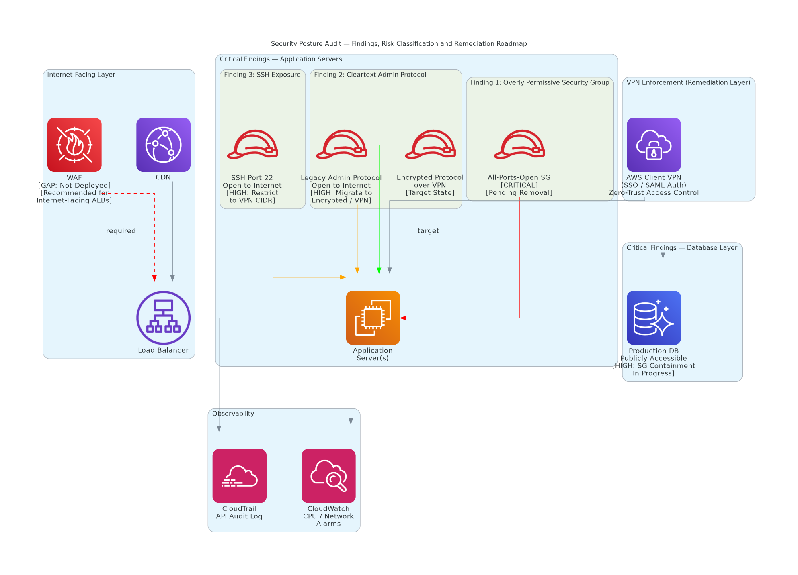

# AWS Infrastructure Audit

A structured security and operational audit of a live AWS environment, covering identity, network exposure, compute lifecycle, storage posture, and cost optimization.

---

## Overview

This project documents the end-to-end audit of an AWS environment across key risk domains. The goal was to establish a clear baseline of the current security posture, identify high-risk findings, and produce actionable remediation runbooks with verified CLI steps.

All changes to the live environment follow a strict change record process: audit first, document fully, then act.

---

## Scope

| Domain | Focus |
|---|---|
| **IAM** | Users, roles, policies, MFA enforcement, access key age |
| **Network** | Security groups, publicly accessible resources, VPC exposure |
| **Compute** | EC2 instances, Elastic Beanstalk environments, runtime lifecycle |
| **Database** | RDS/Aurora instances, public accessibility, engine versions |
| **Storage** | EBS volumes: encryption status, type (gp2/gp3), attachment state |
| **Serverless** | Lambda functions: runtime versions, EOL status |
| **Cost** | Unattached resources, oversized instances, storage class optimization |

---

## Key Findings (Sanitized)

### Network / Security Groups
- Security groups with `0.0.0.0/0` ingress on sensitive ports (MySQL, Redis) attached to production database clusters
- Multiple RDS/Aurora instances publicly accessible with no IP restriction
- Internet-facing load balancers and CDN distributions with no WAF Web ACLs deployed

### IAM
- Majority of IAM users without MFA enabled
- Long-lived access keys (some exceeding 365 days) on active accounts
- Overly broad managed policies with wildcard actions on sensitive services
- AWS Config not recording IAM changes, leaving no audit trail

### Compute Lifecycle
- Elastic Beanstalk environments running Amazon Linux 1 (EOL)
- EC2 Windows instances with pending health events
- Lambda functions on deprecated runtimes (nodejs16.x, nodejs14.x, nodejs12.x)

### Storage
- All EBS volumes unencrypted
- Majority of EBS volumes on gp2 (not gp3)
- Unattached EBS volumes incurring unnecessary cost

---

## Change Record Format

```
CR-YYYY-MM-DD-###_Name.md
├── Summary
├── Risk rating
├── Pre-change state (CLI output)
├── Remediation steps (exact CLI commands)
├── Post-change validation
└── Rollback plan
```

---

## Repository Structure

```
aws-infrastructure-audit/
├── README.md
├── CHANGE-LOG.md
├── findings/
│   ├── network-exposure.md
│   ├── iam-posture.md
│   ├── compute-lifecycle.md
│   ├── storage-posture.md
│   └── cost-optimization.md
├── change-records/
│   ├── iam/
│   ├── network/
│   ├── compute/
│   └── storage/
└── scripts/
    ├── audit-security-groups.sh
    ├── audit-iam-users.sh
    └── audit-ebs-volumes.sh
```

---

## Tech Stack

- AWS CLI, AWS Config, CloudTrail
- RDS, Aurora, EC2, Lambda, Elastic Beanstalk, IAM, VPC
- PowerShell, Bash / Git

> All resource identifiers, account IDs, ARNs, IP addresses, and internal naming have been sanitized.


## Architecture Diagram



